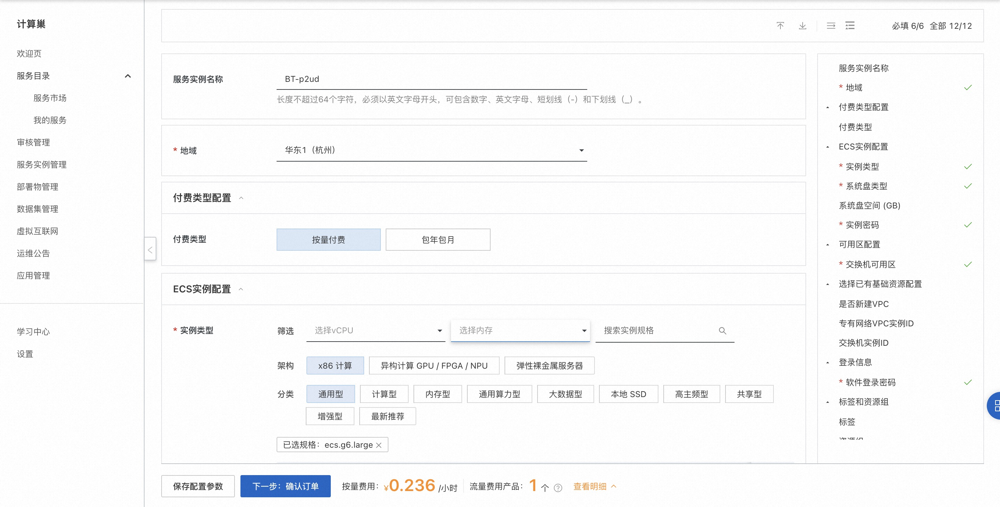
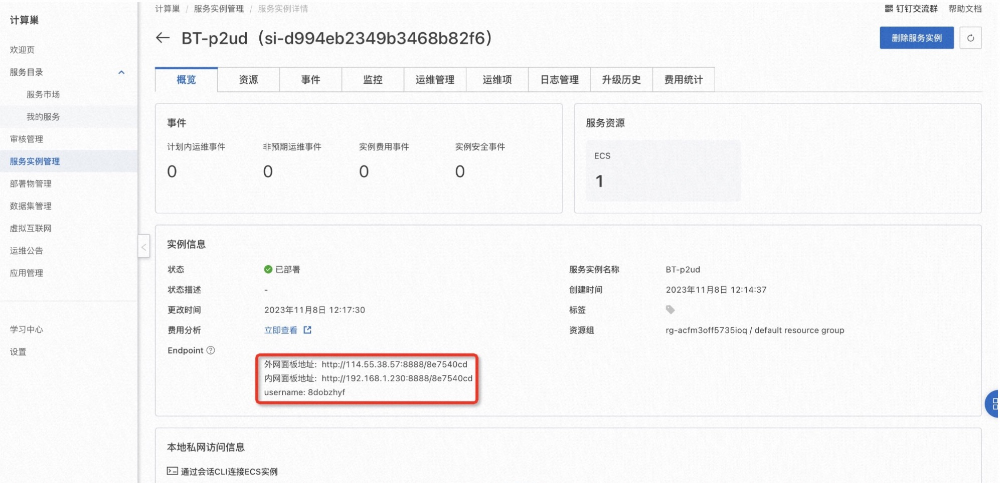
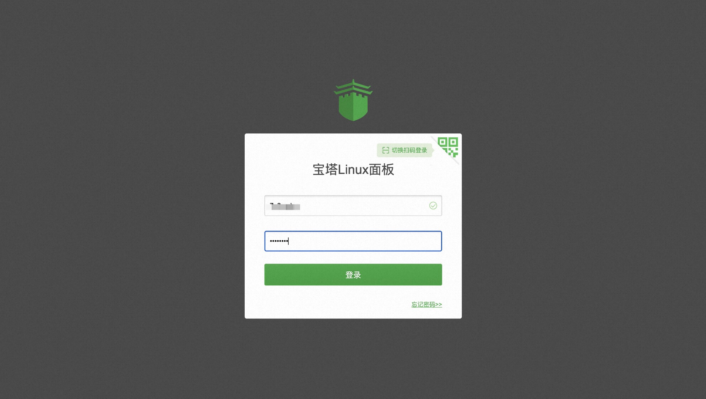

# 宝塔Linux面板服务实例部署文档

## 概述

宝塔Linux面板是提升运维效率的服务器管理软件，支持一键LAMP/LNMP/集群/监控/网站/FTP/数据库/JAVA等100多项服务器管理功能。有30个人的专业团队研发及维护，经过200多个版本的迭代，功能全，少出错且足够安全，已获得全球百万用户认可安装。

## 计费说明

宝塔Linux面板在计算巢上的费用主要涉及：

- 所选vCPU与内存规格
- 磁盘容量
- 公网带宽

计费方式：按量付费（小时）

预估费用在创建实例时可实时看到。

## 部署架构

宝塔Linux面板社区版是单机部署架构。

## RAM账号所需权限

宝塔Linux面板服务需要对ECS、VPC等资源进行访问和创建操作，若您使用RAM用户创建服务实例，需要在创建服务实例前，对使用的RAM用户的账号添加相应资源的权限。添加RAM权限的详细操作，请参见[为RAM用户授权](https://help.aliyun.com/document_detail/121945.html)
。所需权限如下表所示。

| 权限策略名称                          | 备注                         |
|---------------------------------|----------------------------|
| AliyunECSFullAccess             | 管理云服务器服务（ECS）的权限           |
| AliyunVPCFullAccess             | 管理专有网络（VPC）的权限             |
| AliyunROSFullAccess             | 管理资源编排服务（ROS）的权限           |
| AliyunComputeNestUserFullAccess | 管理计算巢服务（ComputeNest）的用户侧权限 |
| AliyunCloudMonitorFullAccess    | 管理云监控（CloudMonitor）的权限     |

## 部署流程

### 部署步骤

单击[部署链接](https://computenest.console.aliyun.com/service/instance/create/cn-hangzhou?spm=5176.24779694.0.0.25df4d22smFSgm&type=user&ServiceId=service-0cf59a2a85f5430ea36f)
，进入服务实例部署界面，根据界面提示，填写参数完成部署。

### 部署参数说明

您在创建服务实例的过程中，需要配置服务实例信息。下文介绍宝塔Linux面板服务实例输入参数的详细信息。

| 参数组          | 参数项        | 示例           | 说明                                                                        |
|--------------|------------|--------------|---------------------------------------------------------------------------|
| 服务实例名称       |            | BT-t4x5      | 实例的名称                                                                     |
| 地域           |            | 华东1（杭州）      | 选中服务实例的地域                                                                 |
| 付费类型配置       | 按量付费       | 华东1（杭州）      | 选中服务实例的地域                                                                 |
| 可用区配置        | 可用区        | 可用区J         | 可用区                                                                       |
| 基础配置         | 是否新建VPC    | false        | 是否新建VPC                                                                   |
| 基础配置         | VPC ID     | vpc-***      | 专有网络VPC                                                                   |
| 基础配置         | VSwitch ID | vsw-***      | 专有网络VPC                                                                   |
| ECS实例配置      | 实例类型       | ecs.g6.large | 实例规格，可以根据实际需求选择                                                           |
| ECS实例配置      | 系统盘类型      | cloud_essd   | 系统盘类型，可以根据实际需求选择                                                          |
| ECS实例配置      | 系统盘空间      | 200          | 系统盘空间，可以根据实际需求选择                                                          |
| ECS实例配置      | 实例密码       | ********     | 设置实例密码。长度8~30个字符，必须包含三项（大写字母、小写字母、数字、()`~!@#$%^&*-+={}[]:;'<>,.?/ 中的特殊符号） |
| 登录信息         | 登录密码       | ********     | 设置登录密码。长度8~30个字符，必须包含三项（大写字母、小写字母、数字、()`~!@#$%^&*-+={}[]:;'<>,.?/ 中的特殊符号） |

### 验证结果

1. 服务实例创建成功后，部署时间大约需要2分钟。部署完成后，进入服务实例详情页。
2. 服务部署成功后在概览页可获取宝塔Linux面板登录信息。
   
3. 使用服务实例详情页输出的用户名和创建服务实例时输入的登录密码登录宝塔Linux面板。
   

### 使用宝塔Linux面板

请访问宝塔Linux面板官网了解如何使用宝塔Linux面板：[宝塔Linux面板使用文档](https://www.bt.cn/new/index.html)
